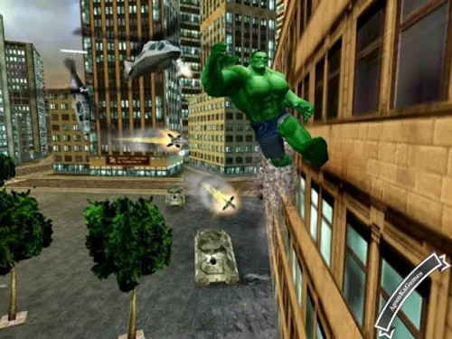
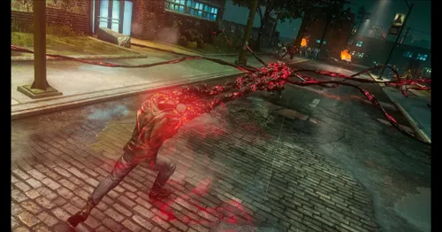

#VillainMan

**Can You Destroy the city in time?**

## מהות המשחק

The Game revolves around you being ViallinMan, who is a Bad guy who you can choose from a roster of villains with different powers. You'r objective is to Destroy the city in a given ammount of time (until the hero comes to stop you). You will be put in a hand crafted city level where you will nedd to cause enough damage to pass the levels requirements, If you manage you cause enough damage then you will face the hero in a sort of boss battle where if you beat him then you win the level. you will go through levels and beat various heroes untill you reach the final level where you fight a superman esc hero and if you beat him you won the game. upon winning/losing you will recieve coins and exp which will allow you to unlock other villains, upgrades and maybe cosmetics. It will be developed for PC

## רכיבים רשמיים

ענו על השאלות הבאות לגבי הרכיבים הרשמיים של המשחק
(החליפו את הטקסט של השאלות בתשובות שלכם).

המחישו את התשובות שלכם בעזרת ציורי-מסך.

### 1. שחקנים

*The game is designed for a casual audience who might to play an arcady game for short/long bursts. It will be SinglePlayer level based with a very light story getting you from level to level.

### 2. יעדים

*The player will need to destroy cars, building, general infrustructure, cops/military/tanks/helicopers etc.. If the player didnt cause enough chaos then the hero will come and automatically stop him. If the player manages to cause enough damage the player will have a boss battle with the hero and will be able to complete the level by defeating the boss.
* The game will have a tutorial and hints to help the player throughout the game 

### 3. תהליכים

תארו בפירוט את:

* At first the player will enter the city, he will see a meter indicating how much damage he caused. he will be tasked to destroy a couple of vehicles, a building and fight low difficulty cops and then he will continue the run on hsi own trying to achieve the objective.
*	The player will try to destroy as much objects and enemies to achieve a high enough score to fight the boss. between runs The player will be able to buy charachters, cosmetics and upgrades.
  
*The default charachter will propably have the ability to fly, laser eyes and strength. it will be third person and you will be able to deal melle dammage and ranged damaged to various degrees. other charachters will also have their unique quirks and abilities.

*The player will have an explenations on each charachter before choosing them. 

### 4. חוקים

* The players limits are his health and time. if the player runs out of health he will lose the run, and so is true for if he doesnt cause enough damage.
* Each destroyed object or defeated enemy will provide points twords the player's destruction points which if he get enough of he will win. 
* The game's rules will be explained to the player in the tutorial and in text before starting a level.

### 5. משאבים

* The game's resources are Gold, Exp, Destruction Points
* You will recieve Gold and Exp after each attempt relative to how many destruction points you got.
* And you will recieve Destruction Points by destroying objects or defeating enemies.
* The player will recieve a lower ammount if he loses but still enough to upgrade.
* The player will have counter for Gold and will have a level indicating how much Exp he got. The player wont really know about destruction points but will have a meter indicating how much more destructions he needs to do.

### 6. עימותים

מה יהיו העימותים המרכזיים במשחק:

* Main difficulty will be in doing enough damage fast, dealing with enemies and a boos fight at the end of each level.,
* The player wont have much self conflict as he is a Villain and the game will have a comic tone to it
   

### 7. גבולות

*The world will be hand crafted levels. The player will be able to leave the playable area for a short distance but will be warned, if he reaches a certain distance from the playable area he will lose the run. 
*The maps will be various cities who will become ruined the further you destroy them. It will start a nice day with blue skies and cars driving and slowly turn into oranger skies with smoking buldings, fires, 
*and more frantic driving cars and military/ police everywhere.

### 8. תוצאות

* You can either win/lose to the boss/get out of bounds/lose to the timer. 
* The game is mainly skill based with not much luck. 

## סקירת משחקים קיימים
Superhero Simulator: Game that simulates being a superhero and might have similar controls and feel but this game is about being the villain and destroying the city.

Hulk: It has a similar concept where you can cause a lot of damage to a city but it is a story game where my game is more arcady and can be enjoyed in short bursts.

Prototype: A game where you have powers and can cause a lot of destruction. my game is different because it is more focused on destroying the whole city and cause even more chaos.

*In general this game will hit that felling of being free in an interesting sandbox causing destructions and being rewarded for it. It will have a light tone with simple graphics and maybe a little story tieing all the villains and heroes together.

